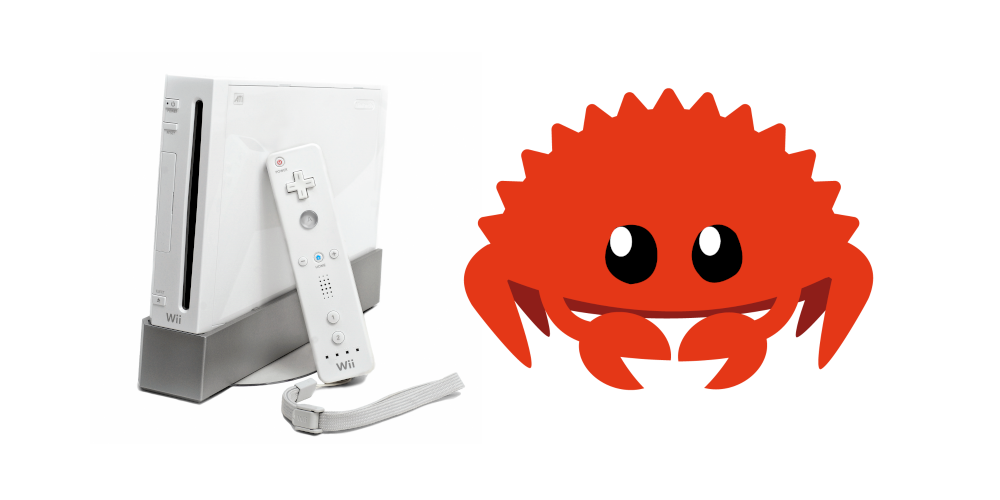

# ogc-engine

<div align="center">
	
</div>

`ogc-engine` is a simple engine for creating games targeting the Wii.
Internally it uses `ogc-rs` and `embedded-graphics`.

## Setup

- `Rust` must be installed. Follow https://rustup.rs/.
- `devkitPro` must be installed. Follow https://devkitpro.org/wiki/Getting_Started.
- `DEVKIT*` environment variables must be set correctly. On Linux it's following:
    - `DEVKITPRO=/opt/devkitpro`
    - `DEVKITARM=/opt/devkitpro/devkitARM`
    - `DEVKITPPC=/opt/devkitpro/devkitPPC`
- `CLANG_VERSION` must be set to your clang version, derived from `clang -v`. For instance: `CLANG_VERSION=12.0.0`.
- `just` is needed for running examples automatically with `dolphin-emu`. Install with `cargo install just`.

## Running examples

```sh
git clone https://github.com/knarkzel/ogc-engine
cd ogc-engine/examples/square
just run
```
